# Zenvo

Node.js environment lock, doctor & repair tool.

[](https://crates.io/crates/zenvo)
[](https://www.npmjs.com/package/zenvo)
[](LICENSE)

## Install

```bash
# npm
npm install -g zenvo

# Homebrew
brew install h-mbl/zenvo/zenvo

# Cargo
cargo install zenvo
```

## Usage

```bash
# Initialize env.lock
zenvo init

# Run diagnostics
zenvo doctor

# Fix issues
zenvo repair --plan
zenvo repair --apply

# Resolve peer dependency conflicts
zenvo resolve

# CI verification
zenvo verify --strict
```

## What it does

Zenvo generates an `env.lock` file that captures your Node.js environment:

```toml
[toolchain]
node = "20.11.0"
package_manager = "pnpm"
package_manager_version = "8.15.1"

[lockfile]
type = "pnpm-lock.yaml"
hash = "sha256:abc123..."

[frameworks]
react = "18.2.0"
next = "14.1.0"
typescript = "5.3.3"
```

When something drifts, `zenvo doctor` tells you what changed and `zenvo repair` fixes it.



## Commands

| Command | Description |
|---------|-------------|
| `zenvo init` | Initialize env.lock in current project |
| `zenvo lock` | Update env.lock to match current state |
| `zenvo doctor` | Run 20+ diagnostic checks |
| `zenvo repair --plan` | Show repair plan |
| `zenvo repair --apply` | Execute repairs |
| `zenvo resolve` | Fix peer dependency conflicts |
| `zenvo verify` | CI mode (exit 1 if drift) |
| `zenvo versions <pkg>` | Search npm package versions |
| `zenvo clean` | Remove caches |

## CI Integration

```yaml
# .github/workflows/verify.yml
name: Verify Environment
on: [push, pull_request]

jobs:
  verify:
    runs-on: ubuntu-latest
    steps:
      - uses: actions/checkout@v4
      - uses: actions/setup-node@v4
        with:
          node-version: '20'
      - run: npm install -g zenvo
      - run: zenvo verify --strict
```

## MCP Server

Zenvo includes an MCP server for AI assistants (Claude, Cursor).

```json
{
  "mcpServers": {
    "zenvo": {
      "command": "zenvo-mcp"
    }
  }
}
```

## Contributing

```bash
git clone https://github.com/h-mbl/zenvo
cd zenvo
cargo build
cargo test
```